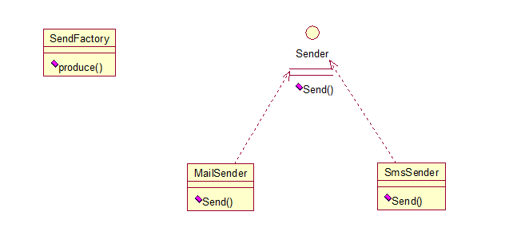
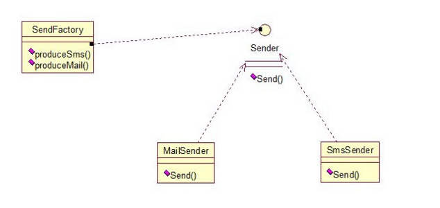

设计模型类别之——构建类别（工厂方法模式）
===========

####模式：工厂方法模式
应用度：5

精妙度：3

原理：
> 定义一个用于创建对象的接口,让子类决定实例化哪一个类,Factory Method使一个类的实例化延迟到了子类。

应用场景：
> 由于需求的变化，一个类的子类经常面临着剧烈的变化，但他却拥有比较稳定的接口。使用一种封装机制来“隔离这种易变对象的变化”，工厂方法定义一个用于创建对象的接口，让子类来确定创建哪一个具体类的对象，将对象的实例化延迟。 

示例场景Case1:
> 发送信息 ，不管你施法短信还是发邮件、还是发微信，发qq信息，只是定义一个稳定的接口，延迟实现。

示例场景Case2:
> 改进版

		
 		 